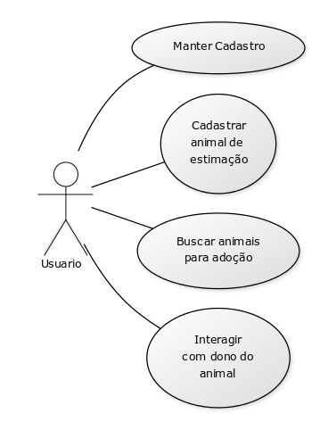

# Casos de uso

## 1. Diagrama de casos de uso

## 2. Especificação dos casos de uso

### 2.1. Caso de uso **REGISTRAR CHAMADO**

| Campo          | Informação        |
|---|---|
| Identificador: | UC01              |
| Nome:          | Manter Cadastro |
| Atores:        | Usuário |
| Sumário:       | Incluir, alterar e excluir cadastro |

| Fluxo Principal |
|---|
| 1) O usuario seleciona seleciona a opção **Alterar cadastro**. |
| 2) O sistema redireciona para pagina de alteração do perfil.                   |
| 3) O Cliente realiza altereção desejada em seu cadastro. |
| 4) O sistema registra que a operação foi bem-sucedida. |

| Fluxo Alternativo (2a): O sistema não encontra as informações do usuário. |
|*| 1) O sistema informa que não conseguiu recuperar as informações do usuário e apresenta a opção de cadastrar o usuário. |
| 2) O Usuario preenche o formulário de cadastro ou entra pelo facebook. |
| 3) O sistema registra os dados do usuário. |
| 4) Volta ao passo (3) do fluxo principal. |

